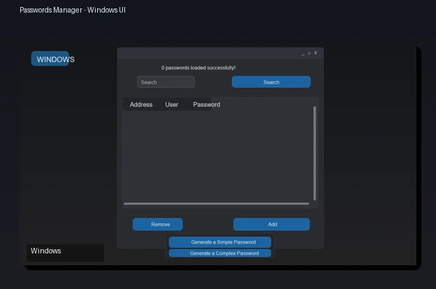

# Password Manager

## Interface



[](https://github.com/JLBBARCO/passwords-manager/actions/workflows/build-release.yml)
[](https://github.com/JLBBARCO/passwords-manager/releases/latest)
[](LICENSE)

This program manages passwords saved in a `passwords.json` or `passwords.csv` file.

It can generate simple and complex passwords and save them to a `passwords.json` file, and also allows the addition or removal of external passwords.

If your passwords saved in a `passwords.csv` file, the last version of the system converts to `passwords.json` automatically.

## 🔐 Encryption System

Passwords are now **automatically encrypted** using the AES (Advanced Encryption Standard) algorithm through the `cryptography` library.

### How It Works

- **When saving**: Passwords are automatically encrypted before being saved to the `passwords.json` file
- **When reading**: Passwords are automatically decrypted when the program displays them
- **Encryption key**: A unique key is generated on first execution and saved in `encryption.key`
- **Automatic migration**: If you have unencrypted passwords, they will be automatically encrypted on first load
- **CSV conversion**: If you have a `passwords.csv` file, it will be automatically converted to encrypted JSON and deleted

### ⚠️ IMPORTANT

- **Keep the `encryption.key` file in a safe location!** Without it, you won't be able to decrypt your passwords.
- Don't share the `encryption.key` file with anyone.
- If you lose the `encryption.key` file, your passwords will be permanently lost.

### Automatic Migration

**It's no longer necessary to run scripts manually!** The system now:

1. **Automatically detects** unencrypted passwords when loading the file
2. **Creates a temporary backup** before migrating (deleted after success)
3. **Encrypts all passwords** automatically
4. **Converts CSV files** to encrypted JSON and deletes them
5. All of this happens transparently on first execution

If you prefer to do the migration manually with more control, you can still use:

```bash
python migrate_to_encrypted.py
```

## Installation

### 1. Install Dependencies

**Option 1 - Windows (using libs.bat):**

```bash
cd src/lib
libs.bat
```

**Option 2 - Any Operating System:**

```bash
pip install -r requirements.txt
```

### 2. Run the Program

```bash
python main.py
```

## Structure of `passwords.json`

- Passwords are saved in a dict named `passwords`
- Items in the list have this syntax: `{"address": "", "user": "", "password": ""}`
- **⚠️ Passwords are now stored in encrypted format**

## Structure of `passwords.csv`

- Lines are separated by Enter;

- Columns are separated by `;`;

- The first line contains the column names, which are:

1. Address

2. Username

3. Password

## Downloads

## Package Managers

### Windows (winget)

After the package is published in winget, install with:

```powershell
winget install JLBBARCO.PasswordsManager
```

### Linux and macOS (script installer)

Install directly from latest GitHub Release:

```bash
curl -fsSL https://raw.githubusercontent.com/JLBBARCO/passwords-manager/main/scripts/install-unix.sh | bash
```

Uninstall:

```bash
curl -fsSL https://raw.githubusercontent.com/JLBBARCO/passwords-manager/main/scripts/uninstall-unix.sh | bash
```

### macOS and Linux (Homebrew tap alternative)

This repository now includes a Homebrew formula template at `packaging/homebrew/passwords-manager.rb`.

You can host it in your own tap and install with:

```bash
brew tap <your-org>/passwords-manager
brew install passwords-manager
```

### � Pre-Compiled Executables

Download the latest version compiled automatically:

**[⬇️ Latest Release](https://github.com/JLBBARCO/passwords-manager/releases/latest)**

Available for:

- **Windows**: `passwords-manager-windows.zip`
- **Windows Installer**: `install-passwords-manager.exe`
- **Linux**: `passwords-manager-linux.tar.gz`
- **macOS**: `passwords-manager-macos.tar.gz`

Executables are automatically compiled via GitHub Actions with each update.

### 🏷️ Previous Versions

[All Releases](https://github.com/JLBBARCO/passwords-manager/releases)

### 🔧 Run from Source Code

Prefer to run from source code? See the [Installation](#installation) section above.

## 🤖 Automatic Build

This project uses GitHub Actions to automatically compile the program with each commit to the main branch. For more information about the build process, see [GITHUB_ACTIONS.md](GITHUB_ACTIONS.md).

## 📚 Documentation

- **[GITHUB_WORKFLOWS.md](.github/GITHUB_WORKFLOWS.md)** - General documentation and usage guide
- **[ENCRYPTION.md](ENCRYPTION.md)** - Technical documentation of the encryption system
- **[GITHUB_ACTIONS.md](GITHUB_ACTIONS.md)** - Documentation about automatic builds
